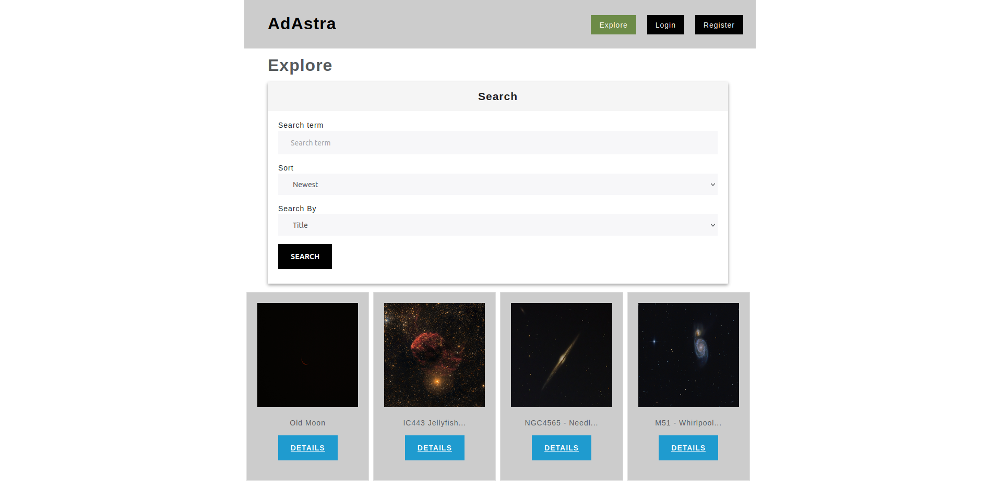
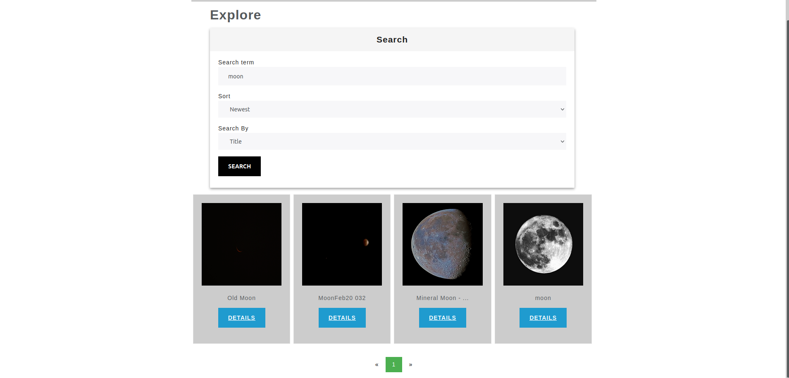
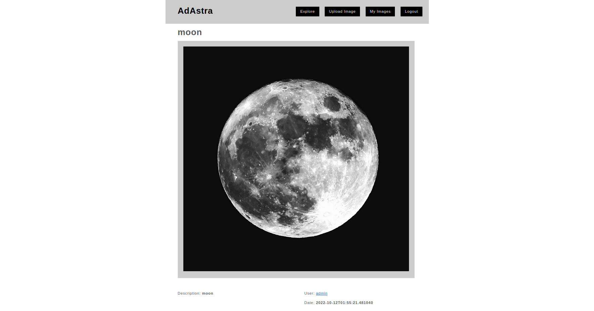
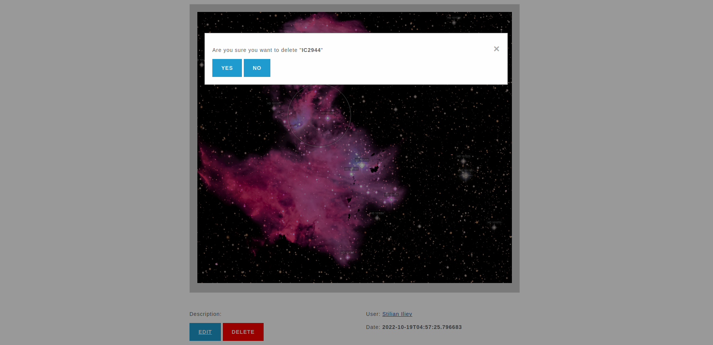
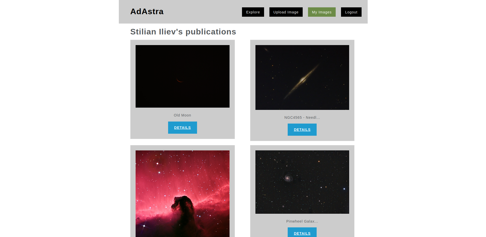
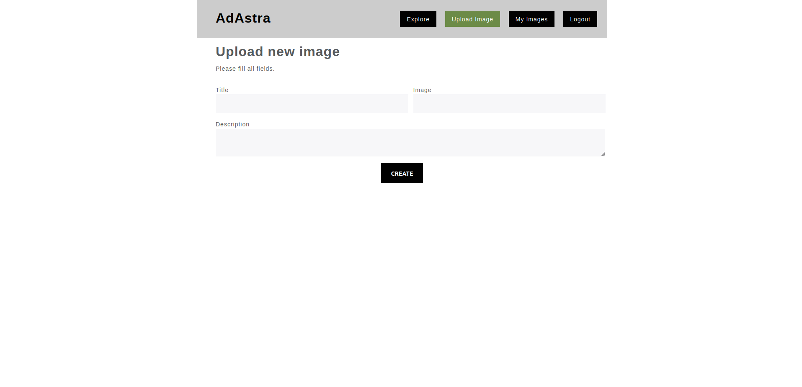

# AdAstra

A place where astrophotographers can share their photography.

## Features

- Basic user authentication
- Publications
    * Full CRUD
- Search page
    * Search by multiple criteria
    * Sort by multiple criteria
    * Pagination
- User page

## About the project

The app was built using Spring Boot. Using Thymeleaf for templating engine. Mysql database.
## Screenshots

